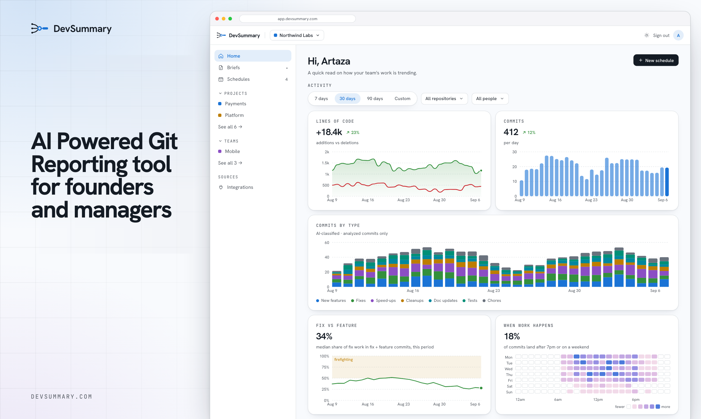

# DevSummary

**AI-powered Git reporting for founders and managers.**

A plain-English read on what your team shipped — written from the commits already in GitHub, and kept on your computer.



DevSummary watches the branches you choose, classifies every commit, and turns a stretch of diffs into a brief someone who does not read code can follow. Scope it to a project, a team, a person, or one repository. It runs on a schedule or whenever you ask, and a desktop notification tells you when the brief is ready.

## What you get

- **The week, in one glance.** Lines changed, commit volume, and how the work splits across new features, fixes, speed-ups, cleanups, docs, tests, and chores — plus when the work actually happens.
- **Briefs a non-engineer can read.** A title and a summary aimed at founders, managers, and anyone else who should know what shipped without opening a diff.
- **Your cadence.** Daily, weekly, or monthly, in your timezone — or generate one on demand for a window you pick.
- **Your machine, your keys.** The database is a directory on disk. GitHub is reached with a token you paste. The write-up is produced by an AI provider you choose: OpenAI, Gemini, or a coding agent already signed in on this computer (Claude Code, OpenCode, Cursor, Codex). Nothing else is contacted. The full host list is in [`docs/EGRESS.md`](docs/EGRESS.md).

Free software, GPL v3. Run it, read it, change it, share it.

## Install

Debian and Ubuntu, from the apt repository:

```bash
sudo install -m 0755 -d /etc/apt/keyrings
curl -fsSL https://virtualpirate.github.io/devsummary-desktop/devsummary.asc \
  | sudo tee /etc/apt/keyrings/devsummary.asc >/dev/null
echo "deb [signed-by=/etc/apt/keyrings/devsummary.asc] https://virtualpirate.github.io/devsummary-desktop ./" \
  | sudo tee /etc/apt/sources.list.d/devsummary.list
sudo apt update && sudo apt install devsummary
```

Upgrades come from `apt upgrade`. [`docs/install-apt.md`](docs/install-apt.md) has the key fingerprint to check against, and removal.

macOS, Windows, and the AppImage are on the [releases page](https://github.com/VirtualPirate/devsummary-desktop/releases). The macOS build is not notarized yet; see [Packaging](#packaging).

## Set it up

Open the app. There is no account and no sign-in — it lands on the dashboard.

1. **Connect GitHub.** Create a [fine-grained personal access token](https://github.com/settings/personal-access-tokens/new) with **Contents: Read-only** and **Metadata: Read-only** on the repositories you want, and paste it. DevSummary reads through your own access, so a repository you can see is a repository it can see. Pasting the token lists repositories; it does not fetch history yet.
2. **Choose a branch.** Pick one branch per repository and a history window (30 or 90 days), then press Start. That is what begins ingestion and the first AI spend. A repository reads one branch, and that choice is write-once until changing it is supported. A repository you leave without a branch stays completely inert.
3. **Pick an AI provider.** Paste an OpenAI or Gemini key, or point DevSummary at Claude Code, OpenCode, Cursor, or Codex if that CLI is already installed and signed in. The same screen lets you override the models and shows the running token totals.

Desktop notifications are on by default. That is how a finished brief reaches you. Every brief is also readable in the app.

---

## For developers

A single-user Electron port of a multi-tenant cloud app. Nothing is hosted: the database is a directory on disk, background work runs in-process, and every credential is the user's own.

**Stack.** Electron shell → NestJS backend on loopback → React 19 + Vite renderer. [PGlite](https://pglite.dev/) (Postgres compiled to WASM) instead of a Postgres server, a `jobs` table plus a poll loop instead of Temporal, pasted credentials instead of OAuth installs.

### Run from source

Node ≥ 22.12 and pnpm.

```bash
pnpm install
pnpm dev
```

`pnpm dev` builds the shared packages, starts Vite on :5173, and opens the Electron window. First boot creates the database, applies the migrations and seeds one local user and a default workspace ("My Workspace"); the app opens straight on the dashboard. There is no sign-in and never will be.

Other commands:

```bash
pnpm build                    # packages → backend → frontend → desktop
pnpm dist                     # build, then package with electron-builder (see caveat below)
pnpm lint                     # every workspace
pnpm --filter backend test    # unit tests (Jest)
pnpm --filter backend test:e2e  # end-to-end (Vitest + in-memory PGlite; no Docker, no network)
```

### Where your data lives

Everything is under Electron's `userData` directory, named after the app — on macOS that is `~/Library/Application Support/<app>`, on Windows `%APPDATA%\<app>`, on Linux `~/.config/<app>`. `<app>` is `DevSummary` in a packaged build and `desktop` under `pnpm dev`, so **a dev run and an installed build do not share data**. The settings screen shows the exact path in use.

| What | Where |
|---|---|
| Database | `<userData>/data/` — a PGlite directory |
| Credentials | `<userData>/secrets.bin` — encrypted with Electron `safeStorage`, i.e. the OS keychain |
| Logs | `<userData>/logs/app.log.<n>` — `pino-roll` appends the number, so there is no plain `app.log`; the highest number is the live one. Rolled at 50 MB, 7 kept. `<repo-root>/logs/` only headless, where there is no `userData`; `LOG_FILE_PATH` overrides both |

Nothing is sent anywhere except to GitHub and the chosen AI provider — each only once a credential has been given, and an agent CLI sends to whichever account that binary is logged into rather than to us. Host by host, with the payload and the credential that switches it on: [`docs/EGRESS.md`](docs/EGRESS.md). The backend listens on a random loopback port and every request needs a per-boot token, so other processes on the machine cannot read the data over HTTP either.

A headless `pnpm --filter backend start:dev` uses `./.data` instead, and has no keychain — see `apps/backend/.env.example`.

### Uninstalling

Deleting the app leaves the data where it is, on purpose — reinstalling picks up the same database. To remove that too, delete the `userData` directory of the build that was run:

| OS | Installed build | `pnpm dev` |
|---|---|---|
| macOS | `~/Library/Application Support/DevSummary` | `~/Library/Application Support/desktop` |
| Windows | `%APPDATA%\DevSummary` | `%APPDATA%\desktop` |
| Linux | `~/.config/DevSummary` | `~/.config/desktop` |

That is the database, the logs and `secrets.bin` in one directory, so one delete is the whole purge — the settings screen prints the exact path, and its **Open** button reveals it in the file manager. Two leftovers it does not cover: on macOS and Linux the OS credential store keeps the key that encrypted `secrets.bin` (an item named after the app, ending in `Safe Storage`), which is harmless once the file is gone but can be deleted from Keychain Access / the keyring; and nothing is revoked at the other end — the GitHub PAT stays valid until it is deleted where it was issued.

### Not in the desktop version

**Email delivery.** There is no SMTP configuration, no email recipients on a schedule or a one-off brief, and no "deliver by email" button — on any screen.

**Slack delivery.** There is no Slack integration page, no bot token field, no channel picker on a schedule or a one-off brief, and no "deliver to Slack" button — on any screen. DevSummary makes no outbound connection to `slack.com`.

A brief is delivered as a desktop notification, and it is always readable in the app itself. Both omissions are deliberate and permanent for the desktop build.

### Packaging

`pnpm dist` runs electron-builder against the config in `apps/desktop` and produces a dmg that has been installed and launched — backend up, migrations applied, briefs generated. What is **not** done is distribution: the bundle is ad-hoc signed (`mac.identity: "-"`), so a *downloaded* dmg is still refused by Gatekeeper without a Developer ID and notarization; there is no Windows certificate. Auto-update does ship — a tag publishes a draft GitHub release, and installs follow that feed — but macOS is notify-only for the same signing reason ([`docs/EGRESS.md`](docs/EGRESS.md)). The mac dmgs and both Linux AppImages have been launched; Windows never has.

Debian and Ubuntu also get a `.deb` and an apt repository — [`docs/install-apt.md`](docs/install-apt.md) for the three commands that install it, how the repo is built (`scripts/apt-repo.sh`) and when it is published (`.github/workflows/apt.yml`, on a *published* release, not on the tag). apt owns upgrades for that build, so the in-app updater stands down there rather than installing over the package manager.

### Tests

```bash
pnpm test                          # backend unit tests (Jest)
pnpm --filter backend test:e2e     # full pipeline over in-memory PGlite — no Docker, no network
pnpm --filter desktop test:bundle  # packaged bundle stays asar-packed
pnpm --filter desktop test:csp     # renderer CSP and navigation locks
```

Beyond those there are manual checks that drive the real app — installing a dmg, booting the AppImage in a container, a packaged upgrade, a run against a real GitHub PAT, and each agent CLI at the LLM boundary. They need credentials or a built artifact, so nothing runs them for you: see `apps/desktop/test/README.md` and `apps/backend/test/agent-cli/README.md`.

### Layout

```
apps/
  desktop/    Electron main + preload: secrets, port handoff, notifications, tray
              test/ also holds the packaging and platform checks
  backend/    NestJS + Kysely over PGlite + the job runner
  frontend/   React 19 + Vite + Tailwind v4 + TanStack Router/Query
packages/
  api-interfaces/  Shared request/response types and Zod schemas
  core/            Small shared utilities
docs/
  EGRESS.md   Every host the app can reach, what is sent, and how to switch it off
  images/     README screenshots
```

`AGENTS.md` at the root carries the product spec and the **Timezones** rules — read that section before touching anything that handles a date. `apps/backend/AGENTS.md` and `apps/frontend/AGENTS.md` cover their own implementations.

### License

**GNU GPL v3.0 or later** — see `LICENSE`. Copyright (C) 2026 Artaza Sameen. Free software: run it, read it, change it, share it, use it at work, fork it, sell it. The condition is copyleft — anyone you give the program or a modified version to gets the same freedoms, which means you pass on the source (or a written offer for it) under the GPL as well. There is no warranty.

`LICENSE` is also the Terms of Use the app shows on first launch, and `PRIVACY.md` is the privacy policy; both ship inside the installer, so they are readable without a network connection. `THIRD-PARTY-NOTICES.md` is the attribution for every bundled dependency and is regenerated on each package by `apps/desktop/build/gen-notices.js`; Chromium's own notices ride along as `LICENSES.chromium.html`. All four land in `Contents/Resources` next to the app.
